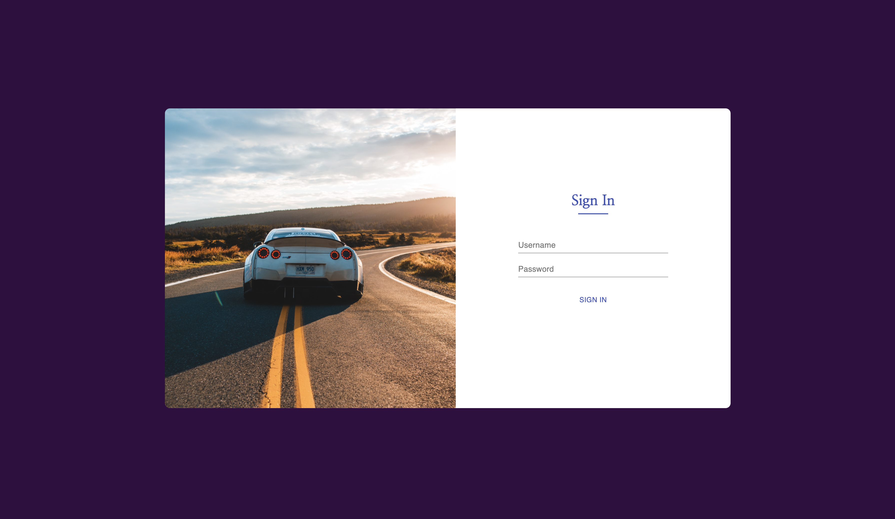
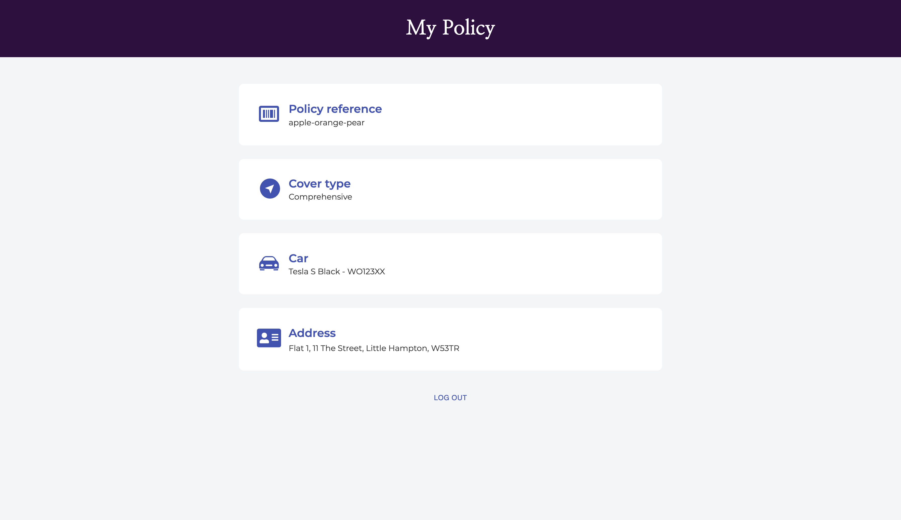

## By Bits Code Challenge

### Log In Page

### My Policy Page

### How to Run
1) Git clone from my repo 
2) Enter client folder -> cd client
3) CLI command -> npm install. 🏗
3) CLI command -> npm run start 🚀
4) Run tests -> npm test. 🎖

### Decisions Taken

- Material UI for form elements
- React icons for policy page
- Fetch api for policy data retrieval
- React Router for navigation
- SASS for styling
- Lottie for loading gif
- Sing In page photo from Unsplash
- React Testing Library and Jest for testing

### Time Spent on Project
Approximately 4 hours
